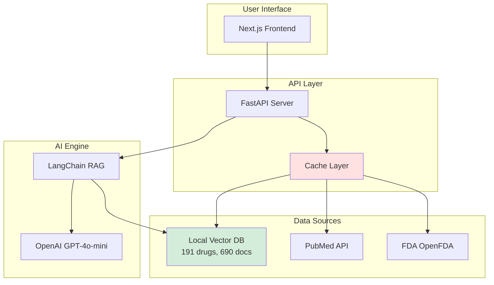

# MediNotes 🏥

AI-powered medical knowledge assistant for healthcare professionals.

## 🎯 Overview

MediNotes helps healthcare professionals quickly access accurate medical information...

（继续保留完整内容，删除所有 <<<<<<<、=======、>>>>>>> 标记）

## 🏗️ Architecture

（继续保留剩余内容）