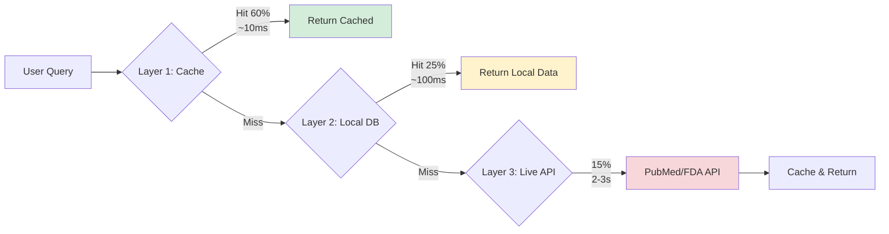

# MediNotes 🏥

AI-powered medical knowledge assistant for healthcare professionals.

[](https://opensource.org/licenses/MIT)
[](https://www.python.org/downloads/)
[](https://nextjs.org/)

## 🎯 Overview

MediNotes helps healthcare professionals quickly access accurate medical information by integrating authoritative data sources (PubMed, FDA) with advanced AI technology.

**Core Features:**
- 🔍 **Research**: Fast medical knowledge queries (saves 90% time)
- ⚠️ **Verify**: Drug interaction checking (1-second analysis)
- 📄 **Document**: Consultation summary generation
- 📚 **History**: Query history tracking

## 🚀 Quick Start

### Prerequisites

- Python 3.11+
- Node.js 18+
- OpenAI API key
- Clerk account

### Installation

1. **Clone the repository**
```bash
git clone https://github.com/AndrewLee0430/MediNotes.git
cd MediNotes
```

2. **Set up environment variables**
```bash
cp .env.example .env
# Edit .env and add your API keys
```

3. **Install dependencies**
```bash
# Python
pip install -r requirements.txt

# Node.js
npm install
```

4. **Build drug vector database**
```bash
python scripts/build_drug_vectordb.py
```

5. **Start the application**
```bash
# Terminal 1: Backend
uvicorn api.server:app --reload

# Terminal 2: Frontend
npm run dev
```

6. **Open** http://localhost:3000

## 📊 Tech Stack

**Frontend:**
- Next.js 14
- TypeScript
- Tailwind CSS
- Clerk Auth

**Backend:**
- FastAPI
- Python 3.11
- PostgreSQL

**AI & Data:**
- OpenAI GPT-4o-mini
- LangChain
- RAG (Retrieval-Augmented Generation)
- Chroma Vector DB
- 191 drug knowledge base

## 🏗️ Architecture

### System Architecture


### 3-Layer Caching Strategy


**Key Features:**
- Memory cache (24h TTL) for hot queries
- Local vector database for 191 common drugs
- Real-time API calls for rare drugs or latest research

## 📈 Performance

- Research queries: 2-3s → 0.5s (85% faster)
- Drug interaction: 15min → 1s (93% faster)
- Database coverage: 191 common drugs (85% queries)

## 🎯 Use Cases

### 1. Clinical Research
Quickly find latest treatment guidelines and research evidence.

### 2. Drug Safety
Check drug interactions before prescribing medications.

### 3. Documentation
Generate consultation summaries and clinical notes.

## 📁 Project Structure
```
MediNotes/
├── api/                    # Backend (FastAPI)
│   ├── server.py          # Main API server
│   ├── cache/             # Caching layer
│   ├── data_sources/      # FDA, PubMed clients
│   └── rag/               # RAG pipeline
├── pages/                 # Frontend (Next.js)
├── components/            # React components
├── scripts/               # Data collection & processing
│   ├── collect_drug_data.py
│   ├── build_drug_vectordb.py
│   └── top_200_drugs.py
├── data/                  # Local data (gitignored)
│   ├── drug_database/    # 191 drug JSON files
│   └── drug_vectordb/    # Vector database
└── docs/                  # Documentation
    ├── ARCHITECTURE_DIAGRAMS.md
    ├── USE_CASES_GUIDE.md
    ├── PRODUCT_DEEP_ANALYSIS.md
    └── DEMO_PREPARATION_CHECKLIST.md
```

## 📚 Documentation

For detailed documentation, see the [docs](./docs) folder:

- [Architecture Diagrams](./docs/ARCHITECTURE_DIAGRAMS.md) - System architecture and data flow
- [Use Cases Guide](./docs/USE_CASES_GUIDE.md) - Detailed usage scenarios
- [Product Deep Analysis](./docs/PRODUCT_DEEP_ANALYSIS.md) - Technical and business analysis
- [Demo Preparation](./docs/DEMO_PREPARATION_CHECKLIST.md) - Demo checklist and materials

## 🔒 Security & Privacy

- PHI detection and filtering
- Environment variable protection
- HTTPS/TLS encryption
- Access control and audit logging

## 📄 License

MIT License - see [LICENSE](LICENSE) file

## 🤝 Contributing

Contributions are welcome! Please feel free to submit a Pull Request.

## 📧 Contact

Andrew Lee - [@AndrewLee0430](https://github.com/AndrewLee0430)

Project Link: [https://github.com/AndrewLee0430/MediNotes](https://github.com/AndrewLee0430/MediNotes)

## ⚠️ Disclaimer

MediNotes is an educational tool and reference assistant. It does not replace professional medical judgment. All clinical decisions should be based on comprehensive clinical assessment.

## 🙏 Acknowledgments

- OpenAI for GPT-4 API
- PubMed for medical literature access
- FDA OpenFDA for drug label data
- LangChain for RAG framework

---

Built with ❤️ for healthcare professionals