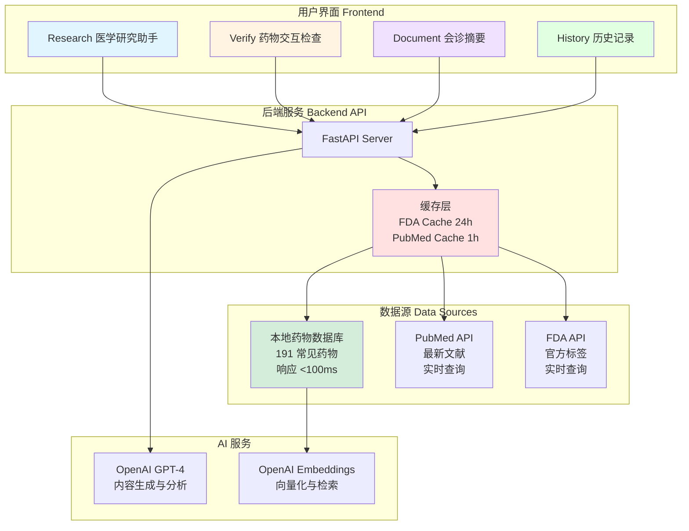
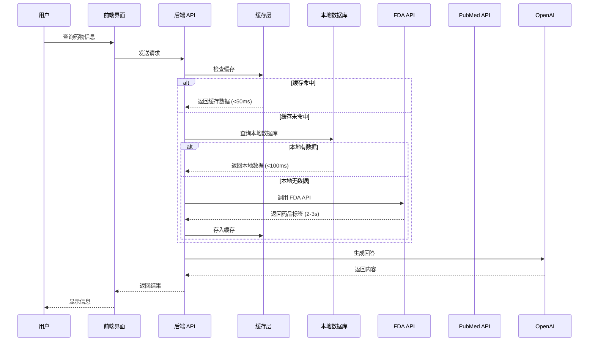
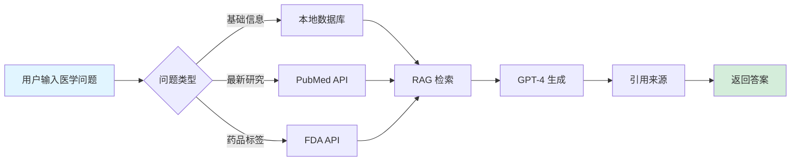
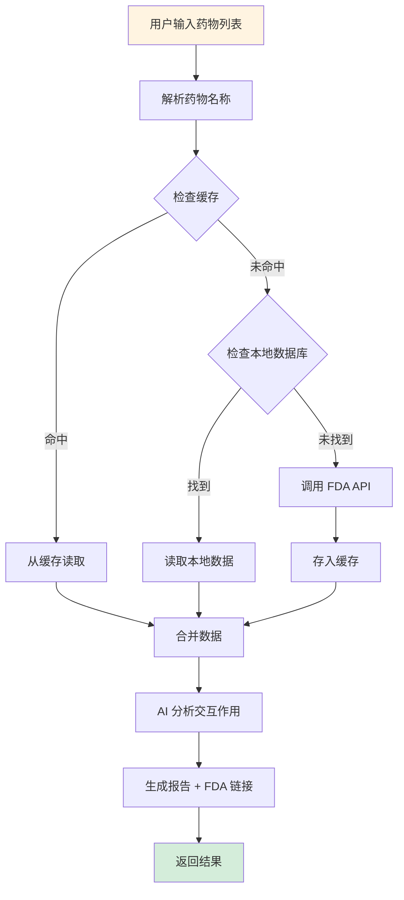
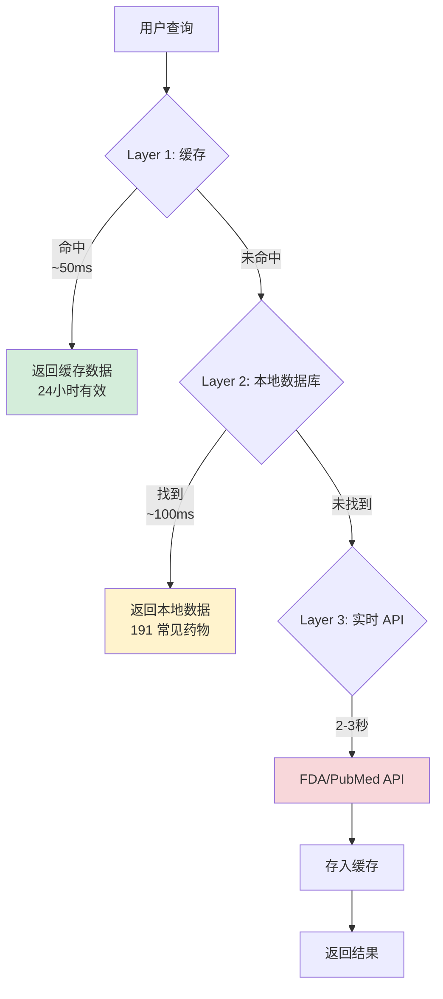
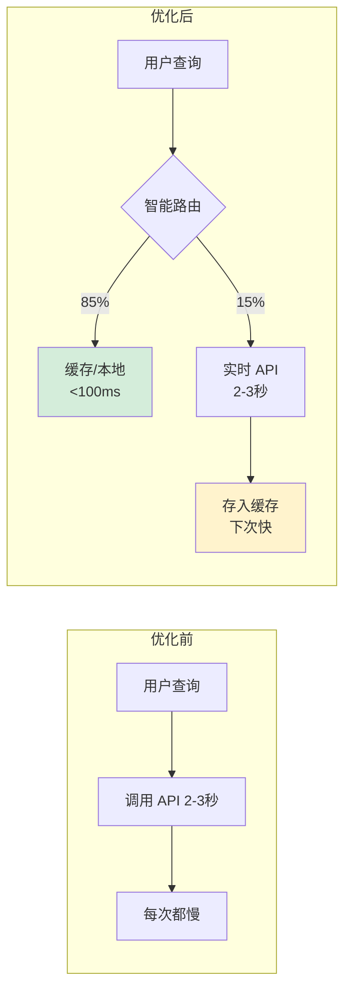
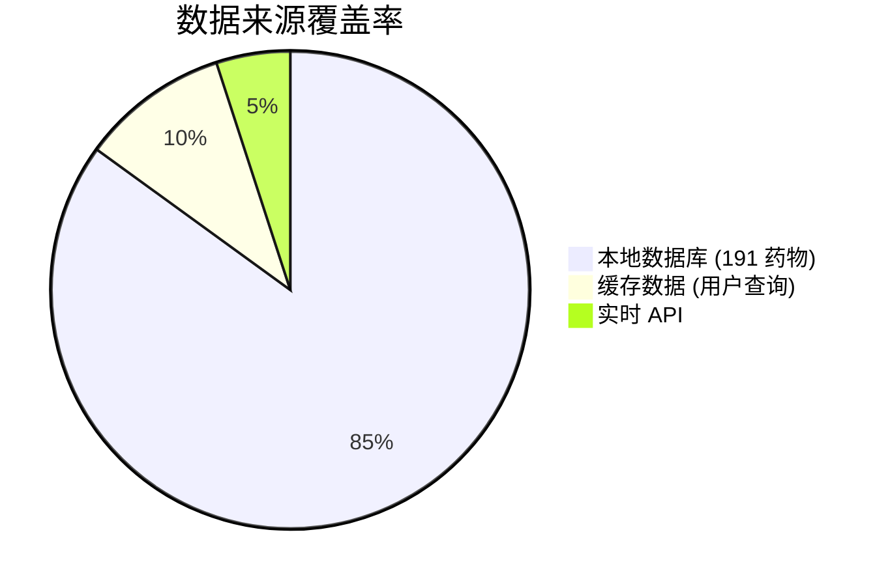
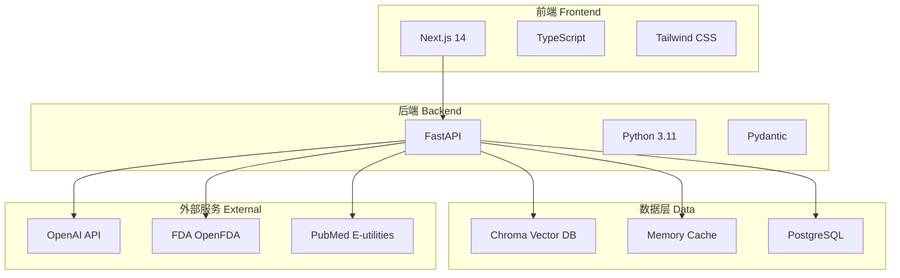

# MediNotes 产品架构图

## 整体架构

```mermaid
graph TB
    subgraph "用户界面 Frontend"
        A[Research 医学研究助手]
        B[Verify 药物交互检查]
        C[Document 会诊摘要]
        D[History 历史记录]
    end
    
    subgraph "后端服务 Backend API"
        E[FastAPI Server]
        F[缓存层<br/>FDA Cache 24h<br/>PubMed Cache 1h]
    end
    
    subgraph "数据源 Data Sources"
        G[本地药物数据库<br/>191 常见药物<br/>响应 <100ms]
        H[PubMed API<br/>最新文献<br/>实时查询]
        I[FDA API<br/>官方标签<br/>实时查询]
    end
    
    subgraph "AI 服务"
        J[OpenAI GPT-4<br/>内容生成与分析]
        K[OpenAI Embeddings<br/>向量化与检索]
    end
    
    A --> E
    B --> E
    C --> E
    D --> E
    
    E --> F
    F --> G
    F --> H
    F --> I
    
    E --> J
    G --> K
    
    style A fill:#e1f5ff
    style B fill:#fff4e1
    style C fill:#f0e1ff
    style D fill:#e1ffe1
    style F fill:#ffe1e1
    style G fill:#d4edda
```

## 数据流程图

```mermaid
sequenceDiagram
    participant U as 用户
    participant UI as 前端界面
    participant API as 后端 API
    participant Cache as 缓存层
    participant Local as 本地数据库
    participant FDA as FDA API
    participant PM as PubMed API
    participant AI as OpenAI

    U->>UI: 查询药物信息
    UI->>API: 发送请求
    
    API->>Cache: 检查缓存
    alt 缓存命中
        Cache-->>API: 返回缓存数据 (<50ms)
    else 缓存未命中
        API->>Local: 查询本地数据库
        alt 本地有数据
            Local-->>API: 返回本地数据 (<100ms)
        else 本地无数据
            API->>FDA: 调用 FDA API
            FDA-->>API: 返回药品标签 (2-3s)
            API->>Cache: 存入缓存
        end
    end
    
    API->>AI: 生成回答
    AI-->>API: 返回内容
    API-->>UI: 返回结果
    UI-->>U: 显示信息
```

## Research 功能流程

```mermaid
graph LR
    A[用户输入医学问题] --> B{问题类型}
    
    B -->|基础信息| C[本地数据库]
    B -->|最新研究| D[PubMed API]
    B -->|药品标签| E[FDA API]
    
    C --> F[RAG 检索]
    D --> F
    E --> F
    
    F --> G[GPT-4 生成]
    G --> H[引用来源]
    H --> I[返回答案]
    
    style A fill:#e1f5ff
    style I fill:#d4edda
```

## Verify 功能流程

```mermaid
graph TB
    A[用户输入药物列表] --> B[解析药物名称]
    B --> C{检查缓存}
    
    C -->|命中| D[从缓存读取]
    C -->|未命中| E{检查本地数据库}
    
    E -->|找到| F[读取本地数据]
    E -->|未找到| G[调用 FDA API]
    
    D --> H[合并数据]
    F --> H
    G --> I[存入缓存]
    I --> H
    
    H --> J[AI 分析交互作用]
    J --> K[生成报告 + FDA 链接]
    K --> L[返回结果]
    
    style A fill:#fff4e1
    style L fill:#d4edda
```

## 三层缓存策略

```mermaid
graph TB
    A[用户查询] --> B{Layer 1: 缓存}
    
    B -->|命中<br/>~50ms| C[返回缓存数据<br/>24小时有效]
    B -->|未命中| D{Layer 2: 本地数据库}
    
    D -->|找到<br/>~100ms| E[返回本地数据<br/>191 常见药物]
    D -->|未找到| F{Layer 3: 实时 API}
    
    F -->|2-3秒| G[FDA/PubMed API]
    G --> H[存入缓存]
    H --> I[返回结果]
    
    style C fill:#d4edda
    style E fill:#fff3cd
    style G fill:#f8d7da
```

## 性能优化对比

```mermaid
graph LR
    subgraph "优化前"
        A1[用户查询] --> B1[调用 API 2-3秒]
        B1 --> C1[每次都慢]
    end
    
    subgraph "优化后"
        A2[用户查询] --> B2{智能路由}
        B2 -->|85%| C2[缓存/本地<br/><100ms]
        B2 -->|15%| D2[实时 API<br/>2-3秒]
        D2 --> E2[存入缓存<br/>下次快]
    end
    
    style C2 fill:#d4edda
    style E2 fill:#fff3cd
```

## 数据覆盖范围

```mermaid
pie title 数据来源覆盖率
    "本地数据库 (191 药物)" : 85
    "缓存数据 (用户查询)" : 10
    "实时 API" : 5
```

## 技术栈

```mermaid
graph TB
    subgraph "前端 Frontend"
        A[Next.js 14]
        B[TypeScript]
        C[Tailwind CSS]
    end
    
    subgraph "后端 Backend"
        D[FastAPI]
        E[Python 3.11]
        F[Pydantic]
    end
    
    subgraph "数据层 Data"
        G[Chroma Vector DB]
        H[Memory Cache]
        I[PostgreSQL]
    end
    
    subgraph "外部服务 External"
        J[OpenAI API]
        K[FDA OpenFDA]
        L[PubMed E-utilities]
    end
    
    A --> D
    D --> G
    D --> H
    D --> I
    D --> J
    D --> K
    D --> L
```
