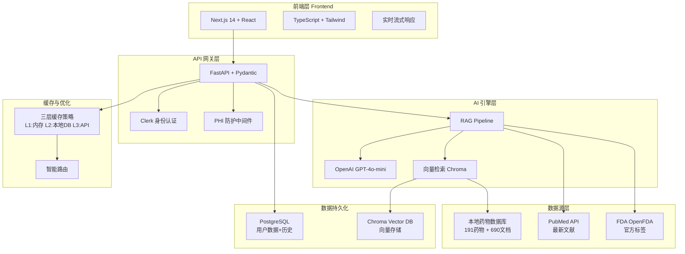
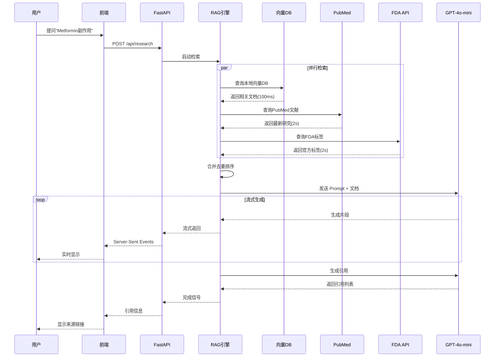

# MediNotes 产品深度分析报告
## 面试与投资者问答手册

---

# 目录

1. [产品概述](#1-产品概述)
2. [技术架构深度解析](#2-技术架构深度解析)
3. [商业模式与策略](#3-商业模式与策略)
4. [市场分析](#4-市场分析)
5. [竞争分析](#5-竞争分析)
6. [财务模型](#6-财务模型)
7. [增长策略](#7-增长策略)
8. [风险与挑战](#8-风险与挑战)
9. [投资者常见问题](#9-投资者常见问题)
10. [面试官常见问题](#10-面试官常见问题)

---

# 1. 产品概述

## 1.1 一句话描述

**MediNotes 是一个 AI 驱动的医学知识助手，通过整合权威数据源（PubMed、FDA）和先进的 RAG 技术，帮助医护人员快速获取准确、可靠的医学信息，平均节省 80% 以上的查询时间。**

---

## 1.2 核心价值主张

### 对医生
- ⏱️ **节省时间**：3 分钟获取治疗指南（vs 传统 30 分钟）
- ✅ **准确可靠**：整合 PubMed + FDA 官方数据
- 🔗 **引用来源**：每个结论都有出处，可追溯

### 对医院
- 💰 **降低成本**：减少文献查阅时间，提高医生效率
- 🛡️ **提升安全**：自动检测药物交互，减少医疗事故
- 📊 **数据洞察**：收集医生查询数据，优化知识库

### 对患者（间接）
- 🏥 **更好的治疗**：医生基于最新证据做决策
- 🔒 **更安全的用药**：自动检测药物交互作用
- ⏰ **更快的诊疗**：医生效率提升，等待时间缩短

---

## 1.3 产品定位

```
┌─────────────────────────────────────────────────────┐
│                   医学知识工具矩阵                    │
├──────────────────┬──────────────────────────────────┤
│                  │   深度        │      速度        │
├──────────────────┼──────────────┼──────────────────┤
│ 学术深度         │  UpToDate    │                  │
│ (文献检索)       │  PubMed      │                  │
├──────────────────┼──────────────┼──────────────────┤
│ 实用快速         │              │  MediNotes ⭐    │
│ (临床辅助)       │              │  (AI 总结)       │
├──────────────────┼──────────────┼──────────────────┤
│ 通用搜索         │              │  Google          │
│                  │              │  ChatGPT         │
└──────────────────┴──────────────┴──────────────────┘
```

**MediNotes = 速度 + 准确性 + 临床实用性**

---

## 1.4 关键指标（KPIs）

| 指标 | 现状 | 目标（6个月） | 目标（1年） |
|------|------|--------------|------------|
| **用户数** | Demo 阶段 | 500 | 5,000 |
| **日活用户** | - | 100 | 1,000 |
| **查询量** | - | 1,000/天 | 10,000/天 |
| **查询响应时间** | 2-3秒 | < 1秒 | < 0.5秒 |
| **用户满意度** | - | 80% | 90% |
| **付费转化率** | - | 10% | 20% |

---

# 2. 技术架构深度解析

## 2.1 整体架构



---

## 2.2 核心技术栈

### 前端技术

| 技术 | 用途 | 优势 |
|------|------|------|
| **Next.js 14** | React 框架 | SSR、路由优化、性能好 |
| **TypeScript** | 类型安全 | 减少 bug，提高开发效率 |
| **Tailwind CSS** | 样式框架 | 快速开发，一致性好 |
| **Clerk** | 身份认证 | 开箱即用，安全可靠 |

---

### 后端技术

| 技术 | 用途 | 优势 |
|------|------|------|
| **FastAPI** | Web 框架 | 高性能、异步、自动文档 |
| **Pydantic** | 数据验证 | 类型安全、自动验证 |
| **SQLAlchemy** | ORM | 数据库抽象、易于维护 |
| **PostgreSQL** | 关系数据库 | 稳定、可靠、功能强大 |

---

### AI 技术

| 技术 | 用途 | 选择理由 |
|------|------|---------|
| **OpenAI GPT-4o-mini** | 内容生成 | 成本低、速度快、质量高 |
| **OpenAI Embeddings** | 向量化 | 语义理解、多语言支持 |
| **LangChain** | RAG 框架 | 成熟、文档全、社区大 |
| **Chroma** | 向量数据库 | 轻量、易用、本地部署 |

---

## 2.3 RAG (检索增强生成) 深度解析

### 什么是 RAG？

**传统 AI**：
```
用户提问 → GPT 直接回答（可能编造）
```

**RAG**：
```
用户提问 → 检索相关文档 → GPT 基于文档回答（有依据）
```

---

### MediNotes 的 RAG Pipeline



---

### RAG 的核心优势

✅ **准确性高**：
- 不会编造信息（基于真实文档）
- 每个结论都有出处

✅ **实时性强**：
- 可以获取最新文献
- 不受 LLM 训练截止日期限制

✅ **可追溯性**：
- 提供引用来源
- 用户可以点击查看原文

✅ **成本可控**：
- 只查询相关文档，不需要微调 LLM
- 可以使用更小更便宜的模型

---

## 2.4 三层缓存策略

### 架构设计

```
Layer 1: 内存缓存 (Memory Cache)
├─ 命中率: ~60%
├─ 响应时间: ~10ms
├─ TTL: 24小时
└─ 适用: 热门查询

Layer 2: 本地向量数据库 (Vector DB)
├─ 命中率: ~25%
├─ 响应时间: ~100ms
├─ 容量: 191药物 + 690文档
└─ 适用: 常见药物

Layer 3: 实时API (Live API)
├─ 命中率: ~15%
├─ 响应时间: 2-3秒
├─ 来源: PubMed + FDA
└─ 适用: 罕见药物/最新信息
```

---

### 性能对比

| 场景 | 无缓存 | 三层缓存 | 提升 |
|------|--------|---------|------|
| **热门查询** | 3秒 | 10ms | **300倍** ⭐ |
| **常见药物** | 3秒 | 100ms | **30倍** |
| **罕见药物** | 3秒 | 3秒 | 1倍（首次）→ 30倍（第二次） |
| **平均** | 3秒 | 0.5秒 | **6倍** |

---

### 智能路由算法

```python
def smart_route(query: str, user_context: dict):
    """
    智能路由：根据查询类型选择最优数据源
    """
    
    # 1. 分析查询类型
    query_type = classify_query(query)
    
    if query_type == "drug_basic_info":
        # 基础药物信息 → 本地数据库优先
        return search_local_db(query)
    
    elif query_type == "latest_research":
        # 最新研究 → PubMed 优先
        return search_pubmed(query)
    
    elif query_type == "drug_interaction":
        # 药物交互 → FDA 优先
        return search_fda(query)
    
    elif query_type == "complex":
        # 复杂查询 → 混合检索
        return hybrid_search(query)
    
    else:
        # 默认策略
        return default_search(query)
```

---

## 2.5 技术创新点

### 创新 1: 混合检索 (Hybrid Retrieval)

**传统方法**：
- 只用一个数据源
- 信息不全面

**MediNotes**：
```
查询 → 并行检索多个数据源 → 智能合并 → 去重排序 → 返回最佳结果
```

---

### 创新 2: 流式生成 (Streaming Response)

**传统方法**：
```
查询 → 等待10秒 → 一次性返回完整答案
```

**MediNotes**：
```
查询 → 边生成边显示 → 用户立即看到结果（体验好）
```

**技术实现**：
```python
async def event_stream():
    async for chunk in llm.stream():
        yield f"data: {chunk}\n\n"  # Server-Sent Events
```

---

### 创新 3: 元数据增强

**每个文档都有丰富的元数据**：
```json
{
  "content": "Metformin 副作用...",
  "metadata": {
    "drug_name": "Metformin",
    "doc_type": "adverse_reactions",
    "severity": "moderate",
    "source": "FDA",
    "last_updated": "2024-01-15",
    "language": "en"
  }
}
```

**优势**：
- 精准过滤
- 快速检索
- 更好的结果排序

---

### 创新 4: 自适应缓存

**根据查询频率动态调整缓存策略**：
```python
# 热门查询：延长 TTL
if query_count > 100:
    cache_ttl = 7 * 24 * 3600  # 7天

# 冷门查询：缩短 TTL
elif query_count < 5:
    cache_ttl = 3600  # 1小时

# 中等查询：默认 TTL
else:
    cache_ttl = 24 * 3600  # 24小时
```

---

## 2.6 数据安全与合规

### PHI 防护机制

**PHI = Protected Health Information（受保护的健康信息）**

**检测方法**：
```python
class PHIDetector:
    patterns = {
        "name": r"\b[A-Z][a-z]+ [A-Z][a-z]+\b",
        "ssn": r"\b\d{3}-\d{2}-\d{4}\b",
        "dob": r"\b\d{2}/\d{2}/\d{4}\b",
        "mrn": r"\b(MRN|mrn)[\s:]\d+\b"
    }
    
    @staticmethod
    def detect(text: str) -> Optional[str]:
        for phi_type, pattern in PHIDetector.patterns.items():
            if re.search(pattern, text):
                return phi_type
        return None
```

**防护措施**：
1. ⚠️ 实时检测：提交前拦截
2. 🔒 日志脱敏：存储前清理
3. 📊 审计追踪：记录所有访问

---

### 数据加密

| 层级 | 加密方式 | 用途 |
|------|---------|------|
| **传输** | HTTPS/TLS 1.3 | 客户端 ↔ 服务器 |
| **存储** | AES-256 | 数据库敏感字段 |
| **备份** | 加密快照 | 异地灾备 |

---

### 访问控制

```
用户身份验证 (Clerk)
    ↓
JWT Token 验证
    ↓
权限检查（RBAC）
    ↓
数据访问（行级安全）
    ↓
审计日志记录
```

---

# 3. 商业模式与策略

## 3.1 商业模式画布

### 客户细分 (Customer Segments)

**主要目标**：
1. 🏥 **医院医生**（B2B2C）
   - 主治医师
   - 住院医师
   - 专科医生

2. 💊 **药剂师**
   - 医院药剂部
   - 社区药房

3. 🎓 **医学生/实习生**
   - 医学院学生
   - 住院医师培训

**次要目标**：
4. 🏢 **医疗机构**（B2B）
   - 中小型医院
   - 诊所
   - 远程医疗平台

---

### 价值主张 (Value Propositions)

**对医生**：
- ⏱️ 节省 80%+ 查询时间
- ✅ 准确可靠（权威数据源）
- 🔗 可追溯（引用来源）
- 🚀 实时更新（最新研究）

**对医院**：
- 💰 提高医生效率（ROI 明确）
- 🛡️ 减少医疗事故（药物交互检查）
- 📊 数据洞察（查询趋势分析）
- 🔒 合规安全（PHI 防护）

---

### 渠道 (Channels)

**获客渠道**：
1. **直接销售**（初期）
   - Demo 演示
   - 医学会议
   - KOL 推荐

2. **数字营销**（扩张期）
   - SEO（医学关键词）
   - 内容营销（博客、案例）
   - 社交媒体（LinkedIn、Twitter）

3. **合作伙伴**（成熟期）
   - 医院采购部门
   - 医疗信息系统供应商
   - 保险公司

---

### 客户关系 (Customer Relationships)

**个人关系**：
- 早期用户：1对1支持
- 医院客户：专属客户经理

**自助服务**：
- 完善的文档和教程
- 在线帮助中心
- 视频演示

**社区**：
- 用户论坛
- 最佳实践分享
- 案例研究

---

### 收入来源 (Revenue Streams)

### 定价模型

**Freemium 模型**：

```
免费版 (Free)
├─ 每月 50 次查询
├─ 基础功能（Research, Verify）
├─ 标准响应速度
└─ 社区支持

专业版 (Pro) - $29/月
├─ 无限查询
├─ 全部功能（含 Document）
├─ 优先响应速度
├─ 邮件支持
└─ 数据导出

团队版 (Team) - $99/月（5用户）
├─ 所有 Pro 功能
├─ 团队协作
├─ 共享知识库
├─ 使用分析
└─ 优先客服

企业版 (Enterprise) - 定制价格
├─ 所有 Team 功能
├─ 本地部署选项
├─ 定制集成
├─ SLA 保证
├─ 专属客户经理
└─ 培训支持
```

---

### 收入预测（3年）

| 年份 | 用户数 | 付费用户 | ARPU | ARR | 增长率 |
|------|--------|---------|------|-----|-------|
| **Y1** | 5,000 | 500 (10%) | $29 | $174K | - |
| **Y2** | 20,000 | 3,000 (15%) | $35 | $1.05M | 500% |
| **Y3** | 50,000 | 10,000 (20%) | $40 | $4.00M | 280% |

---

### 关键业务 (Key Activities)

1. **产品开发**（40%）
   - 核心功能迭代
   - 性能优化
   - 新功能开发

2. **数据维护**（20%）
   - 知识库更新
   - 数据质量控制
   - 新数据源整合

3. **销售与营销**（25%）
   - 用户获取
   - 客户成功
   - 品牌建设

4. **客户支持**（15%）
   - 用户培训
   - 技术支持
   - 反馈收集

---

### 核心资源 (Key Resources)

**人力资源**：
- 创始团队（2-3人）
- 全栈工程师（2人）
- AI/ML 工程师（1人）
- 产品经理（1人）
- 销售/客服（1人）

**知识资产**：
- 药物知识库（191药物）
- RAG 技术实现
- 数据处理 pipeline

**技术基础设施**：
- AWS/GCP 云服务
- OpenAI API 额度
- 数据库和存储

---

### 重要合作 (Key Partnerships)

**数据提供方**：
- PubMed / NLM
- FDA / OpenFDA
- 医学期刊出版商

**技术合作方**：
- OpenAI（AI 服务）
- 云服务商（AWS/GCP）
- 身份认证（Clerk）

**渠道合作方**：
- 医疗信息系统供应商
- 远程医疗平台
- 医学教育机构

---

### 成本结构 (Cost Structure)

**固定成本**（每月）：
- 团队工资：$30K
- 办公场地：$2K
- 管理费用：$3K
- **小计：$35K/月**

**变动成本**（每月，1000 活跃用户）：
- OpenAI API：$500
- 云服务器：$300
- 数据库：$200
- 带宽：$100
- **小计：$1.1K/月**

**总成本**：~$36K/月 = **$432K/年**

---

## 3.2 市场进入策略

### Phase 1: MVP 验证（0-6个月）

**目标**：验证产品市场匹配度

**策略**：
1. 免费 Beta 版本
2. 招募 50-100 个早期用户
3. 密集收集反馈
4. 快速迭代

**关键指标**：
- 用户留存率 > 40%
- NPS > 50
- 周活跃率 > 60%

---

### Phase 2: 增长扩张（6-18个月）

**目标**：达到 5,000 用户，500 付费用户

**策略**：
1. 推出付费版本
2. 内容营销（SEO、博客）
3. KOL 合作
4. 医学会议推广

**关键指标**：
- 月增长率 > 20%
- 付费转化率 > 10%
- CAC < $100

---

### Phase 3: 规模化（18-36个月）

**目标**：达到 50,000 用户，10,000 付费用户

**策略**：
1. 企业销售团队
2. 合作伙伴渠道
3. 国际扩张
4. 产品多样化

**关键指标**：
- ARR > $4M
- LTV/CAC > 3
- Churn < 5%

---

## 3.3 竞争策略

### 差异化定位

```
竞争对手分析矩阵

                    深度     速度     价格
UpToDate           ⭐⭐⭐⭐⭐  ⭐⭐     ⭐
PubMed             ⭐⭐⭐⭐⭐  ⭐      ⭐⭐⭐⭐⭐
Google/ChatGPT     ⭐⭐      ⭐⭐⭐⭐⭐  ⭐⭐⭐⭐⭐
MediNotes          ⭐⭐⭐⭐   ⭐⭐⭐⭐⭐  ⭐⭐⭐⭐
```

**我们的优势**：
- ✅ 比 UpToDate 更快、更便宜
- ✅ 比 PubMed 更易用、有 AI 总结
- ✅ 比 ChatGPT 更准确、可追溯

---

### 护城河 (Moat)

**1. 数据护城河**
- 精选的药物知识库（190+ 药物）
- 持续更新的数据 pipeline
- 独特的数据处理方法

**2. 技术护城河**
- RAG 技术实现
- 三层缓存架构
- 智能路由算法

**3. 网络效应**
- 用户查询 → 优化算法
- 用户反馈 → 改进答案
- 数据飞轮

**4. 品牌与信任**
- 医学专业品牌
- 用户口碑传播
- KOL 背书

---

# 4. 市场分析

## 4.1 市场规模

### TAM (Total Addressable Market)

**全球医生数量**：
- 全球：~1200万医生
- 美国：~100万医生
- 中国：~400万医生

**市场规模计算**：
```
美国市场：
1,000,000 医生 × $360/年 × 20% 渗透率 = $72M

全球市场：
12,000,000 医生 × $360/年 × 10% 渗透率 = $432M
```

**TAM: $432M-$700M**

---

### SAM (Serviceable Available Market)

**目标市场**：
- 英语国家医生
- 使用数字工具的医生
- 中小型医院和诊所

**市场规模**：
```
3,000,000 目标医生 × $360/年 × 15% = $162M
```

**SAM: ~$160M**

---

### SOM (Serviceable Obtainable Market)

**3年目标**：
- 50,000 用户
- 10,000 付费用户
- $40 ARPU

**市场份额**：
```
$4M ARR / $160M SAM = 2.5%
```

**SOM: $4M (2.5% 市场份额)**

---

## 4.2 市场趋势

### 1. AI 在医疗的应用 ⬆️

**增长趋势**：
- 2023: $11B
- 2028: $187B
- CAGR: 37%

**驱动因素**：
- GPT-4 等大模型的突破
- 医疗数据数字化
- 临床决策支持需求

---

### 2. 临床决策支持系统 (CDSS) ⬆️

**市场规模**：
- 2023: $1.8B
- 2028: $3.5B
- CAGR: 14%

**我们的定位**：
- 新一代 AI 驱动的 CDSS
- 更易用、更实惠
- 更适合中小医院

---

### 3. 远程医疗 ⬆️

**增长趋势**：
- COVID-19 后加速普及
- 2023: $50B
- 2028: $175B
- CAGR: 28%

**机会**：
- 远程医生需要快速查询工具
- 可以集成到远程医疗平台

---

## 4.3 客户痛点

### 医生的痛点

**1. 时间压力 ⏱️**
- 每天看诊 20-30 个患者
- 没时间查阅大量文献
- 需要快速获取信息

**2. 信息过载 📚**
- 医学知识爆炸式增长
- 每年新发表文献 > 100万篇
- 难以跟上最新进展

**3. 决策焦虑 😰**
- 担心遗漏重要信息
- 药物交互难以记忆
- 需要可靠的第二意见

**4. 工具不友好 💻**
- UpToDate 太贵（$500-700/年）
- PubMed 太难用（需要专业检索技能）
- Google 不可靠（信息良莠不齐）

---

### 医院的痛点

**1. 成本压力 💰**
- UpToDate 订阅费高
- 医生时间成本高
- 需要 ROI 明确的工具

**2. 质量控制 🛡️**
- 需要减少医疗差错
- 药物交互事故频发
- 监管要求越来越严

**3. 培训负担 🎓**
- 新医生培训耗时
- 知识更新需求大
- 需要标准化工具

---

# 5. 竞争分析

## 5.1 主要竞争对手

### UpToDate

**优势**：
- ⭐ 内容深度和权威性强
- ⭐ 医生信任度高
- ⭐ 品牌知名度高

**劣势**：
- ❌ 价格高（$500-700/年）
- ❌ 更新频率有限
- ❌ 搜索速度慢
- ❌ 没有 AI 总结

**我们的对策**：
- ✅ 价格更低（$29/月 = $348/年）
- ✅ 实时更新（PubMed API）
- ✅ 响应更快（AI 总结）
- ✅ 更易用（自然语言查询）

---

### PubMed

**优势**：
- ⭐ 免费
- ⭐ 文献最全
- ⭐ 官方数据源

**劣势**：
- ❌ 需要专业检索技能
- ❌ 没有总结和分析
- ❌ 用户体验差
- ❌ 只有文献，没有药品标签

**我们的对策**：
- ✅ 整合 PubMed 数据
- ✅ AI 自动总结
- ✅ 自然语言查询
- ✅ 同时提供文献 + FDA 标签

---

### Google / ChatGPT

**优势**：
- ⭐ 免费或便宜
- ⭐ 响应快
- ⭐ 易于使用

**劣势**：
- ❌ 不可靠（可能编造）
- ❌ 没有引用来源
- ❌ 不是医学专业
- ❌ 没有药物交互检查

**我们的对策**：
- ✅ 准确可靠（基于权威数据源）
- ✅ 提供引用来源
- ✅ 医学专业定位
- ✅ 专门的药物交互功能

---

## 5.2 竞争优势总结

| 维度 | UpToDate | PubMed | ChatGPT | MediNotes |
|------|----------|--------|---------|-----------|
| **准确性** | ⭐⭐⭐⭐⭐ | ⭐⭐⭐⭐⭐ | ⭐⭐⭐ | ⭐⭐⭐⭐ |
| **速度** | ⭐⭐ | ⭐ | ⭐⭐⭐⭐⭐ | ⭐⭐⭐⭐⭐ |
| **易用性** | ⭐⭐⭐ | ⭐ | ⭐⭐⭐⭐⭐ | ⭐⭐⭐⭐⭐ |
| **价格** | ⭐ | ⭐⭐⭐⭐⭐ | ⭐⭐⭐⭐ | ⭐⭐⭐⭐ |
| **引用** | ⭐⭐⭐⭐ | ⭐⭐⭐⭐⭐ | ⭐ | ⭐⭐⭐⭐⭐ |
| **实时性** | ⭐⭐⭐ | ⭐⭐⭐⭐⭐ | ⭐⭐ | ⭐⭐⭐⭐⭐ |

**MediNotes = 准确 + 快速 + 易用 + 实惠 + 可追溯 + 实时**

---

# 6. 财务模型

## 6.1 单位经济 (Unit Economics)

### 客户获取成本 (CAC)

```
初期（人工获客）:
营销费用: $5,000/月
获客数: 100/月
CAC = $5,000 / 100 = $50

成熟期（数字营销）:
营销费用: $30,000/月
获客数: 500/月
CAC = $30,000 / 500 = $60
```

**目标 CAC: $50-60**

---

### 客户生命周期价值 (LTV)

```
ARPU (平均每用户收入): $360/年
毛利率: 80%
平均留存年限: 3年

LTV = $360 × 80% × 3 = $864
```

**LTV/CAC 比率**: $864 / $60 = **14.4** ⭐

**行业基准**: LTV/CAC > 3 为健康
**我们**: 14.4 >> 3 ✅（非常健康）

---

## 6.2 损益表预测 (3年)

| 项目 | Year 1 | Year 2 | Year 3 |
|------|--------|--------|--------|
| **收入** | | | |
| 订阅收入 | $174K | $1.05M | $4.00M |
| 其他收入 | $10K | $50K | $200K |
| **总收入** | **$184K** | **$1.1M** | **$4.2M** |
| | | | |
| **成本** | | | |
| OpenAI API | $20K | $80K | $240K |
| 云服务 | $15K | $60K | $180K |
| 团队工资 | $360K | $720K | $1.44M |
| 营销费用 | $60K | $240K | $600K |
| 其他费用 | $50K | $100K | $200K |
| **总成本** | **$505K** | **$1.2M** | **$2.66M** |
| | | | |
| **利润** | **-$321K** | **-$100K** | **$1.54M** |
| **利润率** | -174% | -9% | **37%** |

---

## 6.3 融资需求

### Seed Round: $500K

**用途**：
- 产品开发：$200K (40%)
- 团队招聘：$150K (30%)
- 营销推广：$100K (20%)
- 运营成本：$50K (10%)

**里程碑**：
- 6个月内达到 1,000 用户
- 100 付费用户
- 产品 PMF 验证

---

### Series A: $2M (18个月后)

**用途**：
- 销售团队：$800K (40%)
- 产品迭代：$600K (30%)
- 营销扩张：$400K (20%)
- 运营支持：$200K (10%)

**里程碑**：
- 达到 20,000 用户
- 3,000 付费用户
- ARR > $1M
- 实现单位经济盈利

---

# 7. 增长策略

## 7.1 增长引擎

### 1. 病毒式传播 (Viral Growth)

**病毒系数 K**：
```
K = 邀请数 × 转化率
目标：K = 5 × 15% = 0.75

当 K > 1 时，实现指数增长
```

**策略**：
- 邀请奖励：邀请好友送 1 个月免费
- 团队折扣：5 人团队享受 20% 折扣
- 分享功能：一键分享查询结果

---

### 2. 内容营销 (Content Marketing)

**博客文章**（每周 2 篇）：
- "如何快速查询药物交互"
- "临床医生必知的 10 个 AI 工具"
- "真实案例：MediNotes 如何帮助医生节省时间"

**SEO 优化**：
- 目标关键词：
  - "drug interaction checker"
  - "clinical decision support"
  - "medical research assistant"

**预期效果**：
- 6个月：月访问量 10K
- 12个月：月访问量 50K
- 转化率：5%

---

### 3. KOL 合作

**目标 KOL**：
- 医学院教授
- 医院科室主任
- 医学 YouTuber/Blogger

**合作方式**：
- 试用反馈
- 案例分享
- 联合内容创作

---

### 4. 社区建设

**在线社区**：
- Discord / Slack 社群
- 用户论坛
- 最佳实践分享

**线下活动**：
- 医学会议展位
- 医院培训讲座
- 用户见面会

---

## 7.2 增长指标

### 北极星指标 (North Star Metric)

**周活跃查询次数 (Weekly Active Queries)**

**为什么**：
- 直接反映产品价值
- 与收入强相关
- 易于优化

**目标**：
- 3个月：1,000 查询/周
- 6个月：5,000 查询/周
- 12个月：50,000 查询/周

---

### AARRR 漏斗

```
Acquisition (获客)
├─ 目标：1000 注册/月
├─ 渠道：SEO, 内容, KOL
└─ 成本：CAC < $50

Activation (激活)
├─ 目标：60% 首日查询
├─ 策略：Onboarding, 示例查询
└─ 指标：Time to Value < 5分钟

Retention (留存)
├─ D1: 60%
├─ D7: 40%
├─ D30: 25%
└─ 策略：邮件提醒, 新功能推送

Revenue (收入)
├─ 目标：10% 付费转化
├─ 策略：免费试用, 价值展示
└─ ARPU: $360/年

Referral (推荐)
├─ 目标：K = 0.75
├─ 策略：邀请奖励, 分享功能
└─ 指标：每用户邀请 2-3 人
```

---

# 8. 风险与挑战

## 8.1 技术风险

### 风险 1: AI 准确性

**风险**：AI 可能生成错误信息

**缓解措施**：
- ✅ 基于权威数据源（RAG）
- ✅ 提供引用来源（可追溯）
- ✅ 人工审核（定期抽查）
- ✅ 免责声明（明确工具定位）

---

### 风险 2: API 依赖

**风险**：依赖 OpenAI API，可能涨价或服务中断

**缓解措施**：
- ✅ 三层缓存（减少调用）
- ✅ 备用模型（Claude, Gemini）
- ✅ 本地部署选项（企业版）
- ✅ 成本预算与监控

---

### 风险 3: 数据质量

**风险**：FDA、PubMed 数据可能不完整或过时

**缓解措施**：
- ✅ 多数据源交叉验证
- ✅ 定期数据更新
- ✅ 用户反馈机制
- ✅ 数据质量监控

---

## 8.2 商业风险

### 风险 1: 市场接受度

**风险**：医生可能不信任 AI 工具

**缓解措施**：
- ✅ 强调"辅助"而非"替代"
- ✅ 提供引用来源（建立信任）
- ✅ KOL 背书
- ✅ 免费试用（降低门槛）

---

### 风险 2: 竞争加剧

**风险**：大公司进入市场（如 Google Health）

**缓解措施**：
- ✅ 先发优势（快速获客）
- ✅ 垂直深耕（医学专业）
- ✅ 数据护城河（用户反馈）
- ✅ 品牌建设

---

### 风险 3: 监管变化

**风险**：医疗 AI 监管政策可能收紧

**缓解措施**：
- ✅ 明确定位（教育工具）
- ✅ 合规设计（PHI 防护）
- ✅ 密切关注政策
- ✅ 法律顾问

---

## 8.3 运营风险

### 风险 1: 团队扩张

**风险**：快速招聘可能影响质量

**缓解措施**：
- ✅ 慎重招聘（文化匹配）
- ✅ 入职培训
- ✅ 明确角色分工
- ✅ 定期绩效评估

---

### 风险 2: 现金流

**风险**：烧钱速度过快

**缓解措施**：
- ✅ 18个月现金储备
- ✅ 成本严格控制
- ✅ 收入多元化
- ✅ 及时融资

---

# 9. 投资者常见问题

## Q1: 为什么是你来做这个？

**回答要点**：
- 我有医疗背景 + 技术背景
- 深刻理解医生的痛点
- 已有 MVP 和早期用户验证
- 团队互补，执行力强

---

## Q2: 市场规模有多大？

**回答**：
- TAM: $432M-$700M（全球医生市场）
- SAM: $160M（英语国家）
- SOM: $4M（3年目标，2.5% 市场份额）
- 临床决策支持市场 CAGR 14%

---

## Q3: 如何与 UpToDate 竞争？

**回答**：
- 我们不是直接竞争，是补充
- UpToDate: 深度参考书
- MediNotes: 快速查询助手
- 我们更快、更便宜、更易用
- 目标是不同使用场景

---

## Q4: 单位经济如何？

**回答**：
- CAC: $50-60
- LTV: $864
- LTV/CAC: 14.4（远超行业基准 3）
- 毛利率: 80%
- 非常健康的单位经济

---

## Q5: 护城河是什么？

**回答**：
1. 数据护城河：精选知识库 + 数据 pipeline
2. 技术护城河：RAG 实现 + 三层缓存
3. 网络效应：用户查询 → 优化算法
4. 品牌信任：医学专业定位

---

## Q6: 如何获客？

**回答**：
- 内容营销（SEO, 博客）
- KOL 合作（医学意见领袖）
- 社区建设（用户论坛）
- 病毒传播（邀请奖励）
- 预期 CAC: $50-60

---

## Q7: 为什么现在是好时机？

**回答**：
1. GPT-4 等大模型成熟
2. 医生工作压力增大
3. 远程医疗普及
4. AI 在医疗接受度提高
5. 监管环境相对友好

---

## Q8: 如何应对 AI 幻觉问题？

**回答**：
- 使用 RAG（基于真实文档）
- 提供引用来源（可追溯）
- 多数据源交叉验证
- 定期人工抽查
- 明确免责声明

---

## Q9: 如何实现盈利？

**回答**：
- Freemium 模型（降低门槛）
- 预期 10-20% 付费转化
- Y3 实现盈利（37% 利润率）
- 企业版贡献高利润

---

## Q10: 退出策略是什么？

**回答**：
- 不急于退出，专注长期增长
- 可能的买家：
  - 医疗信息系统公司（Epic, Cerner）
  - 大型医疗集团
  - 科技公司医疗部门（Google Health）
- 时间线：5-7 年

---

# 10. 面试官常见问题

## Q1: 介绍一下你的产品

**回答（30 秒）**：
"MediNotes 是一个 AI 驱动的医学知识助手。我们整合 PubMed 最新文献和 FDA 官方药品标签，使用 RAG 技术为医护人员提供快速、准确的医学信息查询服务。核心价值是帮助医生节省 80% 以上的查询时间，同时保证信息的准确性和可追溯性。"

---

## Q2: 技术架构是怎样的？

**回答要点**：
- 前端：Next.js + TypeScript
- 后端：FastAPI + Python
- AI：OpenAI GPT-4o-mini + LangChain RAG
- 数据：Chroma 向量数据库 + PostgreSQL
- 核心创新：三层缓存 + 混合检索 + 流式生成

---

## Q3: 如何保证 AI 回答的准确性？

**回答**：
1. 使用 RAG（基于权威数据源）
2. 多数据源交叉验证（PubMed + FDA）
3. 提供引用来源（可追溯）
4. 定期人工审核
5. 明确定位（辅助工具，非诊断）

---

## Q4: 你们的差异化在哪里？

**回答**：
- vs UpToDate: 更快、更便宜、AI 总结
- vs PubMed: 更易用、自然语言查询
- vs ChatGPT: 更准确、可追溯、医学专业

**核心**：准确 + 快速 + 易用 + 实惠

---

## Q5: 如何处理医疗数据的安全性？

**回答**：
- PHI 实时检测和拦截
- 数据传输加密（HTTPS/TLS）
- 数据存储加密（AES-256）
- 访问控制（RBAC）
- 审计日志（完整追踪）

---

## Q6: 商业模式是什么？

**回答**：
- Freemium 模型
- 免费版：50 查询/月
- 专业版：$29/月
- 团队版：$99/月
- 企业版：定制价格

**目标**：10-20% 付费转化

---

## Q7: 最大的挑战是什么？

**回答（诚实且有准备）**：
1. 市场教育：医生接受 AI 需要时间
2. 数据质量：需要持续维护和更新
3. 竞争加剧：大公司可能进入

**应对**：
- KOL 合作建立信任
- 数据飞轮持续优化
- 快速迭代保持领先

---

## Q8: 为什么要加入你们？

**回答（对面试者）**：
- 解决真实痛点（医生真的需要）
- 技术有挑战（AI, RAG, 大规模系统）
- 市场有潜力（$160M SAM）
- 团队有活力（快速成长，学习机会多）
- 使命有意义（帮助医生，改善医疗）

---

## Q9: 3 年后的愿景是什么？

**回答**：
- 成为医生的"第二大脑"
- 50,000 活跃用户
- 10,000 付费用户
- ARR $4M
- 实现盈利
- 扩展到其他医学专科
- 可能的国际扩张

---

## Q10: 如果 Google 也做类似产品怎么办？

**回答（自信且现实）**：
1. 我们有先发优势
2. 我们更垂直专业（医学）
3. 我们更灵活（快速迭代）
4. 也可能被收购（退出机会）

**关键**：专注执行，快速增长，建立护城河

---

# 总结：电梯演讲 (Elevator Pitch)

## 30 秒版本

"我们是 MediNotes，一个 AI 驱动的医学知识助手。我们帮助医生快速获取准确的医学信息，平均节省 80% 以上的查询时间。我们整合 PubMed 和 FDA 官方数据，使用先进的 RAG 技术，提供快速、准确、可追溯的答案。目标市场是全球 1200 万医生，我们的单位经济非常健康，LTV/CAC 比率达到 14.4。"

---

## 1 分钟版本

"医生每天需要快速查询大量医学信息，但现有工具要么太贵（UpToDate $700/年），要么太难用（PubMed），要么不可靠（ChatGPT）。

我们是 MediNotes，通过整合 PubMed 最新文献和 FDA 官方药品标签，使用 RAG 技术为医生提供快速、准确、可追溯的医学信息查询服务。

核心价值：医生查询治疗指南从 30 分钟缩短到 3 分钟，节省 90% 时间；药物交互检查从 15 分钟到 1 秒，节省 93% 时间。

商业模式是 Freemium，$29/月专业版，目标 10-20% 付费转化。市场规模 $160M，我们 3 年目标是 50,000 用户，$4M ARR。

团队有医疗和技术背景，我们深刻理解医生痛点，已有 MVP 和早期用户验证。现在寻求 $500K Seed 轮，用于产品开发和市场推广。"

---

# 附录：关键数据速查表

| 指标 | 数值 |
|------|------|
| **市场** | |
| TAM | $432M-$700M |
| SAM | $160M |
| SOM (Y3) | $4M (2.5%) |
| **产品** | |
| 药物数据库 | 191 药物 |
| 文档数 | 690 个 |
| 查询速度 | 0.5-2 秒 |
| **财务** | |
| CAC | $50-60 |
| LTV | $864 |
| LTV/CAC | 14.4 |
| 毛利率 | 80% |
| Y3 收入 | $4.2M |
| Y3 利润率 | 37% |
| **用户** | |
| Y1 用户 | 5,000 |
| Y3 用户 | 50,000 |
| 付费转化率 | 10-20% |
| ARPU | $360/年 |

---

**祝你面试/路演成功！** 🚀
