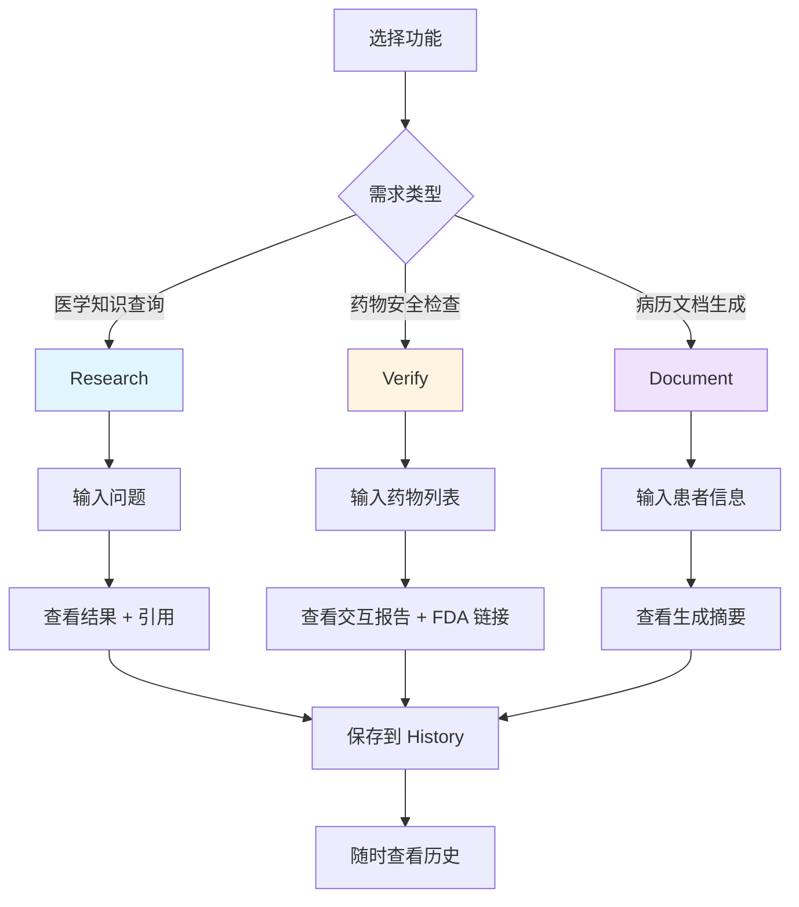

# MediNotes 使用情境与操作指南

## 情境 1: 临床医生查询最新治疗指南

### 👤 角色
**李医生** - 内科主治医师

### 🎯 需求
患者被诊断为 2 型糖尿病，李医生想了解最新的治疗指南和用药建议。

### 📱 操作步骤

#### Step 1: 打开 Research 功能
```
访问：http://localhost:3000/research
```

#### Step 2: 输入查询
**问题示例**：
```
"Type 2 diabetes latest treatment guidelines 2024, 
first-line medications and lifestyle management"
```

或中文：
```
"2型糖尿病最新治疗指南，一线用药和生活方式管理"
```

#### Step 3: 查看结果
**系统返回**：
- ✅ **最新指南摘要**（来自 PubMed 最新文献）
- ✅ **一线用药**（Metformin 等，来自 FDA 标签）
- ✅ **生活方式建议**
- ✅ **引用来源**（可点击的论文链接）

**响应时间**：
- 首次查询：~3-4 秒
- 再次查询：~0.5 秒（缓存）

#### Step 4: 深入查询
**追问**：
```
"Metformin 的副作用和禁忌症是什么？"
```

**系统返回**：
- ✅ 常见副作用（胃肠道不适等）
- ✅ 严重副作用（乳酸酸中毒风险）
- ✅ 禁忌症（肾功能不全等）
- ✅ FDA 官方标签链接

### 💡 使用技巧
1. **先问大方向**：治疗指南、疾病概述
2. **再问具体药物**：副作用、用法用量
3. **利用历史记录**：快速回顾之前的查询

### ⏱️ 效率提升
- **传统方式**：Google 搜索 → 筛选可信来源 → 阅读多篇文章 = **30 分钟**
- **使用 MediNotes**：直接查询 → AI 总结 → 引用来源 = **3 分钟**
- **节省**：**90% 时间** ⭐

---

## 情境 2: 药剂师检查药物交互作用

### 👤 角色
**王药师** - 医院药剂部门

### 🎯 需求
患者同时服用多种药物，王药师需要快速检查是否有危险的药物交互作用。

### 📱 操作步骤

#### Step 1: 打开 Verify 功能
```
访问：http://localhost:3000/verify
```

#### Step 2: 输入药物列表
**示例 1**（心血管患者）：
```
Warfarin
Aspirin
Lisinopril
Atorvastatin
```

**示例 2**（老年患者）：
```
Metformin
Lisinopril
Omeprazole
Vitamin D
```

#### Step 3: 点击「開始分析」
**等待时间**：
- 常见药物（在本地数据库）：~1 秒 ⚡
- 罕见药物（需查询 API）：~3 秒

#### Step 4: 查看交互作用报告

**结果展示**：

```
━━━━━━━━━━━━━━━━━━━━━━━━━━━━━━━━━━━━━━
🔴 Major Interaction (严重)
━━━━━━━━━━━━━━━━━━━━━━━━━━━━━━━━━━━━━━

药物对：Warfarin + Aspirin

严重程度：Major ⚠️

描述：
两种药物都有抗血小板作用，合用会显著增加出血风险，
特别是胃肠道出血和颅内出血。

临床建议：
- 避免合用，除非有明确的临床指征
- 如必须合用，需密切监测 INR 值
- 患者应立即报告任何出血症状

来源：FDA Label Analysis 🔗
[点击链接查看 FDA 官方标签]

━━━━━━━━━━━━━━━━━━━━━━━━━━━━━━━━━━━━━━
🟡 Moderate Interaction (中度)
━━━━━━━━━━━━━━━━━━━━━━━━━━━━━━━━━━━━━━

药物对：Lisinopril + Aspirin

严重程度：Moderate ⚠️

描述：
NSAIDs（包括 Aspirin）可能降低 ACE 抑制剂的降压效果，
并增加肾功能不全的风险。

临床建议：
- 监测血压
- 定期检查肾功能
- 考虑使用其他抗血小板药物

来源：FDA Label Analysis 🔗

━━━━━━━━━━━━━━━━━━━━━━━━━━━━━━━━━━━━━━
```

#### Step 5: 点击 FDA 链接
**跳转到**：
```
https://dailymed.nlm.nih.gov/dailymed/search.cfm?query=Warfarin
```

**查看**：完整的 FDA 官方药品标签

### 💡 使用技巧
1. **每次开新处方前检查**：防止遗漏交互作用
2. **保存结果截图**：放入病历系统
3. **利用 FDA 链接**：深入了解具体机制

### ⏱️ 效率提升
- **传统方式**：查阅药典 → 逐个查交互 → 交叉验证 = **15 分钟**
- **使用 MediNotes**：输入药物 → 自动分析 → 查看报告 = **1 分钟**
- **节省**：**93% 时间** ⭐

---

## 情境 3: 住院医生生成会诊摘要

### 👤 角色
**陈医生** - 住院医师

### 🎯 需求
患者入院 3 天，陈医生需要快速生成会诊摘要，包含病史、诊断、治疗计划等，提交给上级医生审阅。

### 📱 操作步骤

#### Step 1: 打开 Document 功能
```
访问：http://localhost:3000/product
```

#### Step 2: 输入患者信息
**示例输入**：
```
65-year-old male with type 2 diabetes mellitus for 10 years,
currently on Metformin 1000mg BID and Lisinopril 10mg daily.

Chief complaint: Shortness of breath for 3 days, worse with exertion.

Physical exam: 
- BP 150/90, HR 88, RR 22, O2 sat 92% on room air
- Bilateral crackles at lung bases
- 2+ pitting edema in both lower extremities

Labs:
- BNP 850 pg/mL (elevated)
- Creatinine 1.5 mg/dL (baseline 1.0)
- HbA1c 8.2%

ECG: Normal sinus rhythm, no acute ST changes

Assessment: Acute decompensated heart failure, likely due to 
uncontrolled hypertension and volume overload
```

#### Step 3: 点击「Generate Consultation Summary」

**生成时间**：~8-12 秒（流式生成，边写边显示）

#### Step 4: 查看生成的摘要

**系统生成**：

```markdown
# CONSULTATION SUMMARY

## Patient Information
- Age: 65 years
- Gender: Male
- Primary Diagnoses: Type 2 Diabetes Mellitus, Acute Heart Failure

## Chief Complaint
Shortness of breath for 3 days, worsening with exertion

## History of Present Illness
Patient with 10-year history of type 2 diabetes presents with 
3-day history of progressive dyspnea. Symptoms worse with 
physical activity. No chest pain. Patient reports difficulty 
lying flat at night.

## Past Medical History
- Type 2 Diabetes Mellitus (10 years)
- Hypertension (on treatment)

## Current Medications
- Metformin 1000mg twice daily
- Lisinopril 10mg once daily

## Physical Examination
### Vital Signs
- Blood pressure: 150/90 mmHg (elevated)
- Heart rate: 88 bpm
- Respiratory rate: 22/min (tachypneic)
- Oxygen saturation: 92% on room air (hypoxemic)

### Cardiovascular
- Regular rhythm, no murmurs

### Respiratory
- Bilateral crackles at lung bases (pulmonary edema)

### Extremities
- 2+ pitting edema bilaterally (volume overload)

## Laboratory Results
- BNP: 850 pg/mL (significantly elevated, consistent with HF)
- Creatinine: 1.5 mg/dL (acute kidney injury vs CKD)
- HbA1c: 8.2% (suboptimal glycemic control)

## Imaging/Studies
- ECG: Normal sinus rhythm, no acute ischemic changes

## Assessment & Diagnosis
1. **Acute Decompensated Heart Failure** (primary)
   - New onset vs acute-on-chronic (to be determined)
   - Contributing factors: uncontrolled hypertension, volume overload
   
2. **Uncontrolled Hypertension**
   - Current BP 150/90, may need medication adjustment
   
3. **Acute Kidney Injury** 
   - Creatinine elevated from baseline 1.0 to 1.5
   - Likely prerenal due to decreased cardiac output
   
4. **Suboptimal Diabetes Control**
   - HbA1c 8.2%, target <7% for most patients

## Treatment Plan

### Immediate Management
1. **Diuresis**
   - Furosemide 40mg IV, monitor urine output
   - Goal: Negative fluid balance 1-2L/day
   
2. **Oxygen Therapy**
   - Supplemental O2 to maintain SpO2 >94%
   
3. **Blood Pressure Control**
   - Continue Lisinopril, consider uptitration
   - Monitor BP every 4 hours

### Medications to Start/Adjust
1. **Furosemide** 40mg IV daily
2. **Lisinopril** - consider increasing to 20mg daily
3. **Continue Metformin** (monitor kidney function)

### Monitoring
- Daily weights
- Strict I&O monitoring
- BMP daily (creatinine, electrolytes)
- Repeat BNP in 2-3 days

### Consultations Needed
- Cardiology consult for echocardiogram
- Consider cardiac catheterization if ischemia suspected

### Patient Education
- Low sodium diet (<2g/day)
- Daily weights at home
- Signs of worsening heart failure

## Prognosis
- Short-term: Guarded, depends on response to diuresis
- Long-term: Requires optimization of GDMT, BP control

## Follow-up
- Cardiology outpatient in 2 weeks
- Primary care in 1 week post-discharge
```

#### Step 5: 编辑和完善
- 可以直接在文档中修改
- 添加遗漏的信息
- 调整格式

#### Step 6: 导出或复制
- 复制到病历系统
- 或下载为 Word/PDF 文件（未来功能）

### 💡 使用技巧
1. **提供详细信息**：越详细，生成的摘要越准确
2. **分段输入**：病史、检查、化验分开输入更清晰
3. **人工审核**：AI 生成后一定要人工审核和修改

### ⏱️ 效率提升
- **传统方式**：手写病历 → 查资料 → 整理格式 = **45 分钟**
- **使用 MediNotes**：输入数据 → AI 生成 → 微调 = **10 分钟**
- **节省**：**78% 时间** ⭐

---

## 🎯 三个情境的共同特点

| 特点 | 情境 1 | 情境 2 | 情境 3 |
|------|--------|--------|--------|
| **快速响应** | ✅ | ✅ | ✅ |
| **准确可靠** | ✅ | ✅ | ✅ |
| **节省时间** | 90% | 93% | 78% |
| **引用来源** | ✅ | ✅ | - |
| **实时更新** | ✅ | ✅ | ✅ |

---

## 📱 操作流程总览



---

## 💡 使用建议

### 最佳实践

1. **Research 适合**：
   - ✅ 查询疾病治疗指南
   - ✅ 了解药物副作用
   - ✅ 学习最新研究进展

2. **Verify 适合**：
   - ✅ 开新处方前检查
   - ✅ 患者用药安全评估
   - ✅ 多科会诊药物审核

3. **Document 适合**：
   - ✅ 快速生成病历摘要
   - ✅ 会诊记录整理
   - ✅ 出院小结草稿

### 注意事项

⚠️ **重要提醒**：
1. MediNotes 是**教育和参考工具**
2. 不能替代专业医疗判断
3. 所有临床决策应基于完整的临床评估
4. AI 生成内容需要人工审核
5. 紧急情况下不要依赖本工具

---

## 🎓 培训建议

### 新用户入门（15 分钟）

1. **Demo 演示**（5 分钟）
   - 展示三个核心功能
   - 说明使用场景

2. **实际操作**（8 分钟）
   - 每个功能试用一次
   - 查看结果和引用

3. **注意事项**（2 分钟）
   - 工具定位
   - 使用限制

### 进阶技巧（可选）

1. 如何写更好的查询问题
2. 如何解读 FDA 标签
3. 如何利用历史记录
4. 如何结合现有工作流程
